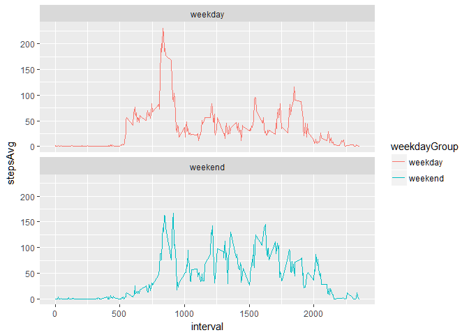

# Reproducible Research: Peer Assessment 1

## Loading and preprocessing the data

First we need to make sure we reference all required libraries

```r
suppressPackageStartupMessages(library(dplyr))
suppressPackageStartupMessages(library(ggplot2))
```

Now we need to load the data and inspect it.

```r
activity <- read.csv("activity.csv")
str(activity)
```

```
## 'data.frame':	17568 obs. of  3 variables:
##  $ steps   : int  NA NA NA NA NA NA NA NA NA NA ...
##  $ date    : Factor w/ 61 levels "2012-10-01","2012-10-02",..: 1 1 1 1 1 1 1 1 1 1 ...
##  $ interval: int  0 5 10 15 20 25 30 35 40 45 ...
```

```r
summary(activity)
```

```
##      steps                date          interval     
##  Min.   :  0.00   2012-10-01:  288   Min.   :   0.0  
##  1st Qu.:  0.00   2012-10-02:  288   1st Qu.: 588.8  
##  Median :  0.00   2012-10-03:  288   Median :1177.5  
##  Mean   : 37.38   2012-10-04:  288   Mean   :1177.5  
##  3rd Qu.: 12.00   2012-10-05:  288   3rd Qu.:1766.2  
##  Max.   :806.00   2012-10-06:  288   Max.   :2355.0  
##  NA's   :2304     (Other)   :15840
```

The 'date' variable was read in as a character Factor and should be a Date datatype.

```r
activity$date <- as.POSIXct(activity$date)
str(activity)
```

```
## 'data.frame':	17568 obs. of  3 variables:
##  $ steps   : int  NA NA NA NA NA NA NA NA NA NA ...
##  $ date    : POSIXct, format: "2012-10-01" "2012-10-01" ...
##  $ interval: int  0 5 10 15 20 25 30 35 40 45 ...
```


##Steps per Day Analysis

Our first analysis is around the total # of steps per day. Let's create a new dataset to hold these values.

```r
dailySteps <- activity %>%
    filter(!is.na(steps)) %>%
    group_by(date) %>%
    summarize(steps=sum(steps))
str(dailySteps)
```

```
## Classes 'tbl_df', 'tbl' and 'data.frame':	53 obs. of  2 variables:
##  $ date : POSIXct, format: "2012-10-02" "2012-10-03" ...
##  $ steps: int  126 11352 12116 13294 15420 11015 12811 9900 10304 17382 ...
```

Let's see a histogram of the # of steps per day

```r
ggplot(dailySteps, aes(x=steps)) +
    geom_histogram(binwidth=1000, color="black") +
    labs(title="Steps per Day", 
         x="# of Steps", 
         y="# of Days"
         )
```

<!-- -->

Let's look at the mean and median # of steps:

* Mean # of steps: 10,766.19
* Median # of steps: 10,765

## Average Daily Activity Pattern Analysis

We want to look at what the average daily activity pattern looks like.  First, lets get a dataset which shows the total and average # of steps for each 5-minute interval

```r
intervalSteps <- activity %>%
    filter(!is.na(steps)) %>%
    group_by(interval) %>%
    summarize(totSteps=sum(steps), avgSteps=mean(steps))
str(intervalSteps)
```

```
## Classes 'tbl_df', 'tbl' and 'data.frame':	288 obs. of  3 variables:
##  $ interval: int  0 5 10 15 20 25 30 35 40 45 ...
##  $ totSteps: int  91 18 7 8 4 111 28 46 0 78 ...
##  $ avgSteps: num  1.717 0.3396 0.1321 0.1509 0.0755 ...
```


Let's chart a time-series graph to see how the daily pattern.

```r
ggplot(intervalSteps, aes(x=interval,y=avgSteps,group=1)) +
    geom_line(color="blue") +
    geom_vline(xintercept = highestPeriod, color="green") +
    labs(title="Average Steps by Interval",
         xlab="5-min Interval",
         ylab="Avg # of Steps"
         )
```

<!-- -->

The 5-minute period which has the maximum average # of steps across all dates is period **835** marked by the green line.


## Imputing Missing Values

There are a number of days/intervals where there are missing values. The presence of missing days may introduce bias into some calculations or summaries of the data.


```r
incompleteRows <- nrow(activity[!complete.cases(activity), ])
incompleteRows
```

```
## [1] 2304
```

So, we know there are **2,304** incomplete rows in the dataset.

We need to replace all missing values (NAs) with a value to help avoid bias.  We'll use the average of the # of steps for the 5-minute period the missing value is associated with.

```r
impute.mean <- function(x) replace(x, is.na(x), mean(x, na.rm = TRUE))
fixedActivity <- activity %>%
    group_by(interval) %>%
    mutate(stepsNew = impute.mean(steps)) %>%
    select(-steps) %>%
    inner_join(activity, by=c('interval','date')) %>%
    select(-steps) %>%
    rename(steps = stepsNew)
summary(fixedActivity)
```

```
##       date                        interval          steps       
##  Min.   :2012-10-01 00:00:00   Min.   :   0.0   Min.   :  0.00  
##  1st Qu.:2012-10-16 00:00:00   1st Qu.: 588.8   1st Qu.:  0.00  
##  Median :2012-10-31 00:00:00   Median :1177.5   Median :  0.00  
##  Mean   :2012-10-31 00:25:34   Mean   :1177.5   Mean   : 37.38  
##  3rd Qu.:2012-11-15 00:00:00   3rd Qu.:1766.2   3rd Qu.: 27.00  
##  Max.   :2012-11-30 00:00:00   Max.   :2355.0   Max.   :806.00
```

```r
incompleteRows <- nrow(fixedActivity[!complete.cases(fixedActivity), ])
incompleteRows
```

```
## [1] 0
```

No we see all rows are complete!

Let's make another Histogram now to see how the daily steps look.

```r
fixedDailySteps <- fixedActivity %>%
    group_by(date) %>%
    summarize(steps=sum(steps))
ggplot(fixedDailySteps, aes(x=steps)) +
    geom_histogram(binwidth=1000, color="black") +
    labs(title="Steps per Day", 
         x="# of Steps", 
         y="# of Days"
         )
```

<!-- -->

Let's look at the mean and median # of steps after the fix is applied compared to the original values:

* Mean # of steps: Original = 10,766.19; New = 10,766.19
* Median # of steps: Original = 10,765; New = 10,766.19

So, it appears that imputing the means had little affect on the estimates of total daily steps!

## Activity Patterns by Weekday

Now let's look at how the activity patterns are affected by whether it's a weekday or a weekend.  First we need to add a factor indicating if it is a weekday or weekend.

```r
# use lubridate package to help identify the weekday of the date
suppressPackageStartupMessages(library(lubridate))
fixedActivity <- fixedActivity %>% mutate(weekdayGroup=as.factor(ifelse(wday(date) %in% c(1,7),"weekend","weekday")))
summary(fixedActivity$weekdayGroup)
```

```
## weekday weekend 
##   12960    4608
```


Let's compare the average # of steps per 5-minute interval across the weekday groups.

```r
weekdayIntervalSteps <- fixedActivity %>%
    group_by(interval, weekdayGroup) %>%
    summarize(stepsAvg=mean(steps),steps=sum(steps))
ggplot(weekdayIntervalSteps, aes(x=interval,y=stepsAvg,color=weekdayGroup)) +
    facet_wrap("weekdayGroup", ncol=1) +
    geom_line()
```

<!-- -->


